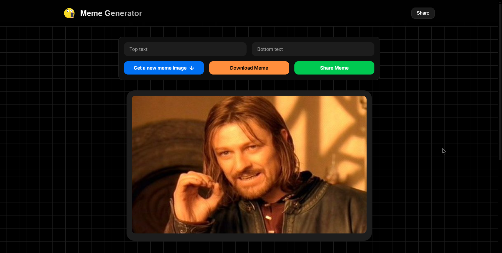
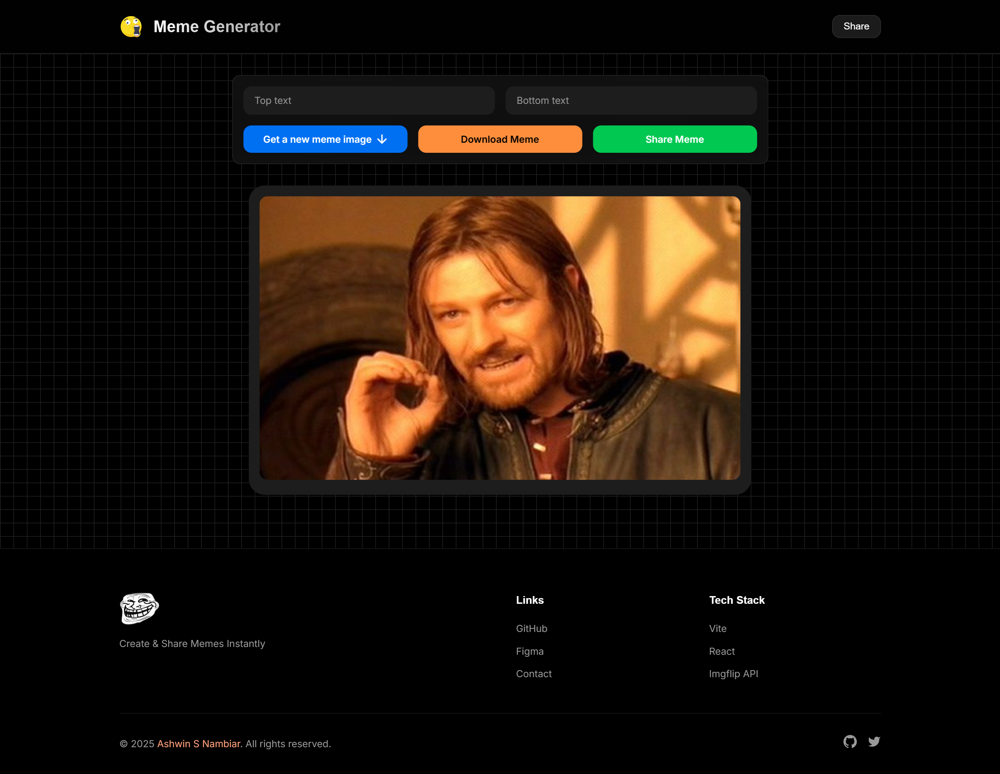
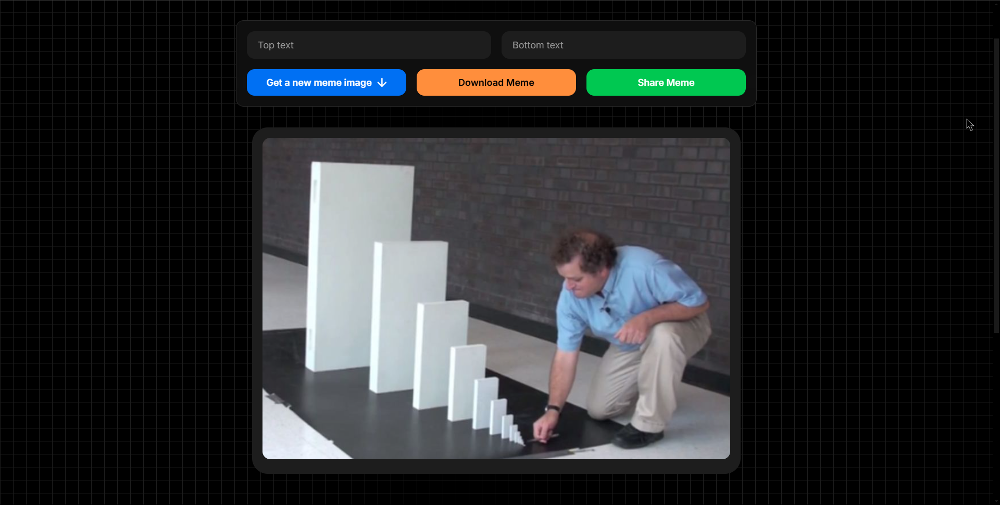
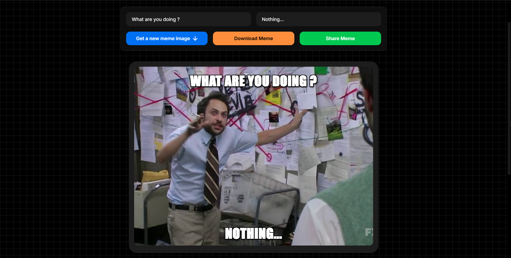
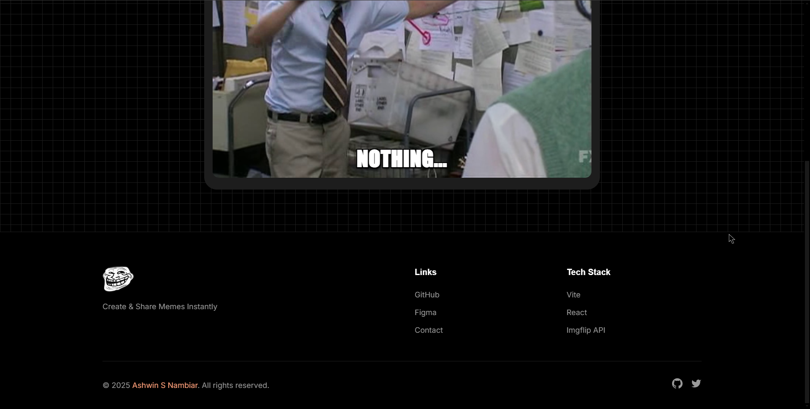
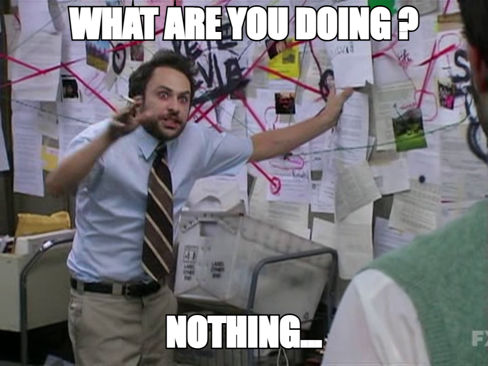
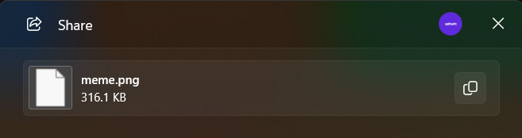

# Meme Generator 😁

<div align="center">


A fun and interactive meme generator that allows users to create their own memes by selecting templates and adding custom text using the Imgflip API.

[Features](#-features) • [Tech Stack](#-tech-stack) • [Installation](#-installation) • [Contributing](#-contributing) • [Screenshots](#-screenshots) • [Live](#-live) • [Author](#-author)

</div>

## 🎨 Features

- 🖼 **Meme Template Selection** - Choose from a wide range of meme templates.
- ✍ **Custom Text Input** - Add top and bottom text to personalize your meme.
- ⚡ **Instant Meme Preview** - See real-time updates while editing.
- 🌍 **API Integration** - Fetches templates dynamically from the Imgflip API.
- 📱 **Responsive Design** - Optimized for mobile and desktop users.

## 🛠 Tech Stack

### Frontend
- **[React](https://reactjs.org/)** - UI component development
- **[Vite](https://vitejs.dev/)** - Fast build tool and development server
- **[HTML5](https://developer.mozilla.org/en-US/docs/Web/Guide/HTML/HTML5)** - Structuring the web app
- **[CSS3](https://developer.mozilla.org/en-US/docs/Web/CSS)** - Styling and layout
- **[JavaScript](https://developer.mozilla.org/en-US/docs/Web/JavaScript)** - Core logic and interactivity

### API
- **[Imgflip API](https://imgflip.com/api)** - Get the meme templates

## 🚀 Installation

1. **Clone the repository**
   ```bash
   git clone https://github.com/Ashwin-S-Nambiar/meme-generator.git
   cd meme-generator
   ```

2. **Install dependencies**
   ```bash
   npm install
   ```

3. **Start the development server**
   ```bash
   npm run dev
   ```
   **The application will be accessible at `http://localhost:5173`.**

## 🤝 Contributing

Contributions are welcome! Here's how you can help improve the Color Scheme Generator:

1. Fork the repository
2. Create a feature branch:

   ```bash
   git checkout -b feature/amazing-feature
   ```

3. Commit your changes:

   ```bash
   git commit -m 'Add some amazing feature'
   ```

4. Push to the branch:

   ```bash
   git push origin feature/amazing-feature
   ```

5. Open a Pull Request

## 📸 Screenshots

<div align="center">

### **App Interface**


### **App Full Interface**


### **Generate New Meme Template**


### **Adding Text to Template**


### **Footer**


### **Downloaded Meme**


### **Share Meme**



</div>

## 🌍 Live

<div align="center">

[](https://meme-generator-five-nu.vercel.app/)

</div>

## 👤 Author

### Ashwin S Nambiar
- Portfolio: [ashwin-s-nambiar.is-a.dev](https://ashwin-s-nambiar.is-a.dev/)
- GitHub: [@Ashwin-S-Nambiar](https://github.com/Ashwin-S-Nambiar)

---

<div align="center">
Made with ❤️ by Ashwin S Nambiar
</div>
